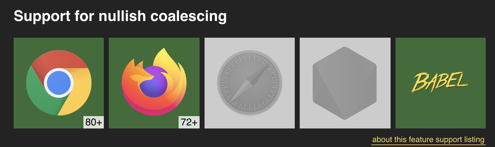
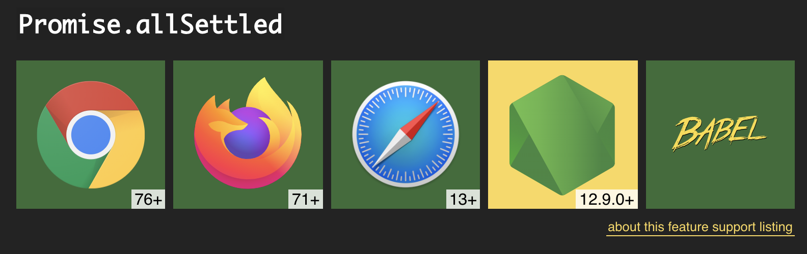

# ES2020 Features using TypeScript

These are new ES2020 features that you can use now with TypeScript 3.8.

* Git clone this repo
* `npm i`

## Optional chaining

Dealing with properties of objects that may be undefined.

Code: [src/optional-chaining.ts](src/optional-chaining.ts).

See: [Implementing a maybe pattern using a TypeScript type guard](https://www.joshwulf.com/blog/2019/02/typescript-maybe/)

Run:

`npm run optional`

## Nullish coalescing

Dealing with default values when falsy values are valid.

Code: [src/nullish-coalescing.ts](src/nullish-coalescing.ts).

Run:

`npm run nullish`

## Promise.allSettled

Dealing with an array of tasks that may succeed or fail.

Code: [src/promise-allSettled.ts](src/promise-allSettled.ts).

See: [Handling failure and success in an array of asynchronous tasks](https://www.joshwulf.com/blog/2020/03/array-async-failure/)

Run:

`npm run promise`